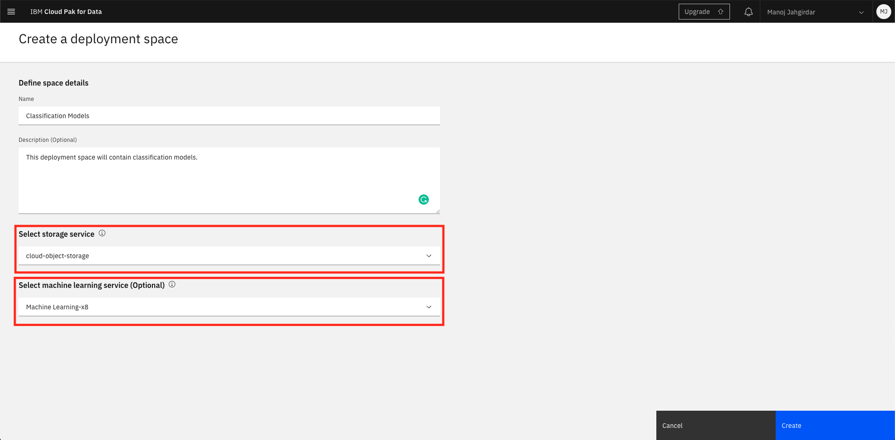
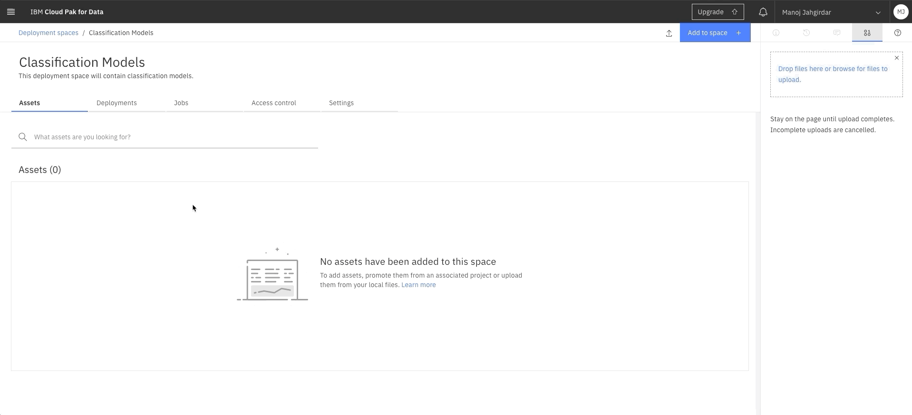

# Watson Machine Learning v3 / v4 beta to v4 migration details

This is a migration guide for developers to migrate their existing assets from WML v3/v4 beta to WML v4.

## Table of contents:
1. [Specifying credentials](#1-specifying-credentials)
2. [Creating a client object](#2-creating-a-client-object)
3. [Creating deployment space and setting up default deployement space for your project](#3-creating-deployment-space-and-setting-up-default-deployement-space-for-your-project)
4. [Specifying metadata for storing the model](#4-specifying-metadata-for-storing-the-model)
5. [Storing a model (remains same)](#5-storing-a-model-remains-same)
6. [Specifying metadata for deployment (remains same)](#6-specifying-metadata-for-deployment-remains-same)
7. [Specifying input payload for prediction (remains same)](#7-specifying-input-payload-for-prediction-remains-same)
8. [Getting predictions (remains same)](#8-getting-predictions-remains-same)


## 1. Specifying credentials

#### **OLD**: Credentials were generated from `IBM Cloud > Resources > WML Instance > Service Credentials`


```python
wml_credentials = {
    "apikey":"",
    "url": "",
    "instance_id": ""
}
```

#### **NEW**: Apikey has to be generated from `IBM Cloud > Resources > WML Instance > Manage > Access (IAM) > API keys > Create an IBM Cloud API key`
>NOTE: 
1. `instance_id` is no longer required.
2. `url` will change based on the region where the WML Instance is deployed in your IBM Cloud, Example:
    - London: <https://eu-gb.ml.cloud.ibm.com>
    - Dallas: <https://us-south.ml.cloud.ibm.com>


```python
apikey = "<APIKEY_FROM_IAM>"
```


```python
wml_credentials = {
    "apikey": apikey,
    "url": "https://eu-gb.ml.cloud.ibm.com"
}
```

## 2. Creating a client object

#### **OLD**: The `watson_machine_learning_client` and `WatsonMachineLearningAPIClient` libraries were used in v3 / v4 beta.


```python
from watson_machine_learning_client import WatsonMachineLearningAPIClient

client = WatsonMachineLearningAPIClient(wml_credentials)
```

#### **NEW**: The `ibm_watson_machine_learning` and `APIClient` libraries have to be used in v4.


```python
!pip install -U ibm-watson-machine-learning
```


```python
from ibm_watson_machine_learning import APIClient

client = APIClient(wml_credentials)
```

## 3. Creating deployment space and setting up default deployement space for your project

#### **NEW**: A deployment space has to be created in Watson Studio / Cloud Pak for Data.

- In IBM Cloud, goto **resources** and select **Watson Studio** instance, click on **Get Started** to launch Watson Studio / Cloud Pak for Data.

- In Watson Studio / Cloud Pak for Data, click on the hamburger menu on the top left corner and select **Deployment spaces > View all spaces**.


- In deployment spaces, click on **New deployment space +**.

- Select **Create an empty space** when prompted.

- Make sure you select the appropriate **Cloud object storage service** as well as **Machine learning service**.



>NOTE: In v4 Machine learning assets are stored in Cloud Object Storage rather than in the Watson Machine Learning repository.

- Once the deployment space is created, click on **View Space** to view the details.

- Click on **Settings** and copy the `space ID`.



> Learn more about deployment space [here](https://eu-gb.dataplatform.cloud.ibm.com/docs/content/wsj/wmls/wmls-deploy-overview.html).

```python
space_id = "<DEPLOYMENT_SPACE_ID_FROM_WATSON_STUDIO>"
```

#### **NEW**: The deployment space id that you specified in the above step has to be set as the default deployment space for the project.


```python
client.spaces.list(limit=10)
```


```python
client.set.default_space(space_id)
```

## 4. Specifying metadata for storing the model

#### **OLD**: `RUNTIME_UID` was being used to specify the runtime of a model in v3 / v4 beta.


```python
metadata = {
    client.repository.ModelMetaNames.NAME: 'Personal Loan Prediction Model',
    client.repository.ModelMetaNames.TYPE: "scikit-learn_0.20",
    client.repository.ModelMetaNames.RUNTIME_UID: "scikit-learn_0.20-py3.6"  
}
```

#### **NEW**: `SOFTWARE_SPEC_UID` has to be specified in v4.


```python
sofware_spec_uid = client.software_specifications.get_id_by_name("scikit-learn_0.20-py3.6")
```


```python
metadata = {
    client.repository.ModelMetaNames.NAME: 'Personal Loan Prediction model',
    client.repository.ModelMetaNames.TYPE: 'scikit-learn_0.20',
    client.repository.ModelMetaNames.SOFTWARE_SPEC_UID: sofware_spec_uid
}
```

Optionally, to get a list of software specifications run the following:

```python
client.software_specifications.list()
```

## 5. Storing a model (remains same)


```python
published_model = client.repository.store_model(model=naive_model, meta_props=metadata, \
                                                training_data=train_set, training_target=train_labels)
```


```python
import json
published_model_uid = client.repository.get_model_uid(published_model)
model_details = client.repository.get_details(published_model_uid)

print(json.dumps(model_details, indent=2))
```

## 6. Specifying metadata for deploying a model (remains same)


```python
deploy_meta = {
     client.deployments.ConfigurationMetaNames.NAME: 'Deployment of Personal Loan Prediction',
     client.deployments.ConfigurationMetaNames.ONLINE: {}
}
```


```python
created_deployment = client.deployments.create(published_model_uid, meta_props=deploy_meta)
```


```python
deployments = client.deployments.get_details()
```

## 7. Specifying input payload for prediction (remains same)


```python
job_payload = {
client.deployments.ScoringMetaNames.INPUT_DATA: [{
 'values': [[39,139,95616,3,3.4,1,483,0,0,1,0]]
}]
}
```

## 8. Getting predictions (remains same)


```python
did = client.deployments.get_uid(created_deployment)
```


```python
predictions = client.deployments.score(did, job_payload)
```


```python
print(json.dumps(predictions, indent=2))
```


```python
print(predictions["predictions"][0]['values'][0][0])
```

## References

- [Watson Machine Learning Migrating assets](https://eu-gb.dataplatform.cloud.ibm.com/docs/content/wsj/analyze-data/migrating-assets.html?audience=wdp).

- [Watson Machine Learning Python Client Documentation](http://ibm-wml-api-pyclient.mybluemix.net/).

- [Watson Machine Learning authentication](https://eu-gb.dataplatform.cloud.ibm.com/docs/content/wsj/analyze-data/ml-authentication.html?audience=wdp).
